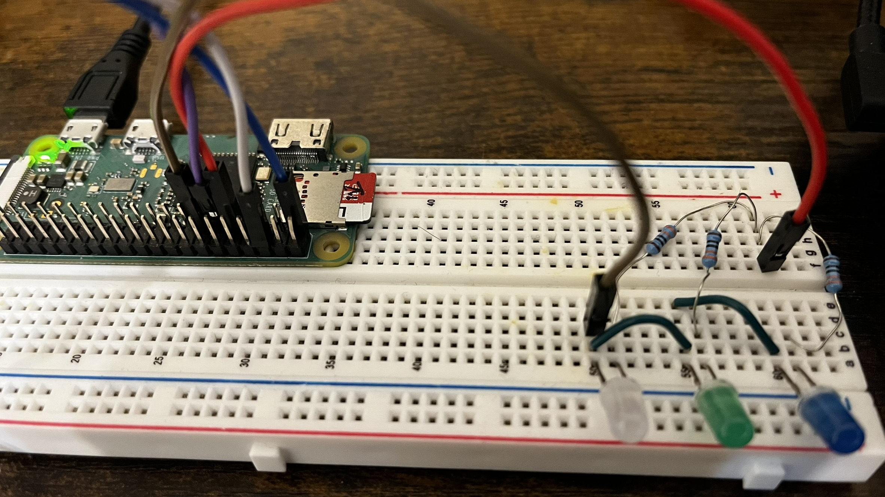
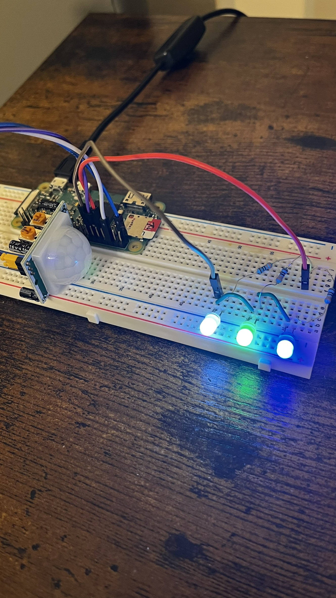

# Raspberry Pi Zero 2 Motion-Activated LED Light

This project uses a Raspberry Pi Zero 2 W and a PIR motion sensor to turn on an LED light when motion is detected. The LED stays on for 10 seconds after any detected motion, then turns off, waits for 2 seconds, and begins checking for motion again.

## 🧰 What You Need

- Raspberry Pi Zero 2 W
- HC-SR501 PIR Motion Sensor
- LED
- 330Ω resistor
- Breadboard and jumper wires
- Python 3 (pre-installed on Raspberry Pi OS)

## 🖥️ Wiring Setup



## 📸 Final Setup



## 🧠 How It Works

1. PIR detects any motion
2. LED turns on for 10 seconds
3. LED turns off
4. Script pauses for 2 seconds
5. Loop resumes, waiting for motion again

## 🚀 Running the Project

Clone this repository and run the script:

```bash
git clone https://github.com/alpsAyon/iot-motion-light-raspberry-pi.git
cd iot-motion-light-raspberry-pi
python3 motion_detector.py
